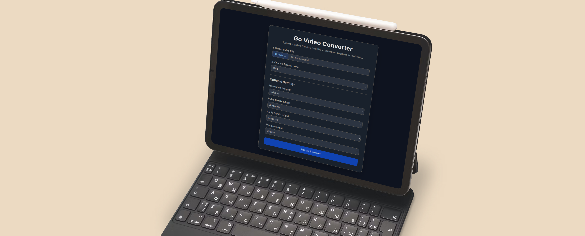

# CloudConv - Web-Based Media Converter
======================================

CloudConv is a powerful, self-hostable web-based media converter built with Go and FFmpeg. It provides a clean, modern interface to upload video files and convert them to various formats in real-time, with a robust backend that includes a job queue, progress tracking, and automatic cleanup.

The application is fully containerized, making setup incredibly simple.

 <!-- Replace with a real screenshot if you have one -->

## ✨ Features

-   **Modern Web UI**: A sleek, responsive interface built with Tailwind CSS.
-   **Real-Time Progress**: Watch the upload and conversion progress live.
-   **Job Queueing**: Handles multiple conversions sequentially.
-   **Format Variety**: Convert to MP4, WebM, MOV, AVI, MKV, and animated GIF.
-   **Customizable Outputs**: Control resolution, bitrate, framerate, and GIF loop settings.
-   **Simple Setup**: Get up and running in minutes with Docker.
-   **Automatic Cleanup**: Old jobs and files are automatically purged to save disk space.

---

## 🚀 Getting Started (Recommended)

The easiest and recommended way to run CloudConv is by using Docker. This method avoids the need to install Go or FFmpeg on your host machine.

### Prerequisites

-   [Docker](https://docs.docker.com/get-docker/)
-   [Docker Compose](https://docs.docker.com/compose/install/)

### Installation

1.  **Create a `docker-compose.yaml` file:**

    Create a file named `docker-compose.yaml` and paste the following content into it:

    ```yaml
    services:
      cloudconv:
        image: kirari04/cloudconv:latest
        ports:
          - 3000:3000
        volumes:
          - ./uploads:/app/uploads
          - ./converted:/app/converted
        restart: always
        environment:
          - TZ=Europe/Berlin # Optional: Set your timezone
    ```

2.  **Create Local Directories:**

    The Docker container needs directories on your host machine to store the uploaded and converted files.

    ```bash
    mkdir uploads converted
    ```

3.  **Run the Application:**

    Start the application using Docker Compose. It will pull the latest image from Docker Hub and start the container in the background.

    ```bash
    docker-compose up -d
    ```

4.  **Access CloudConv:**

    Open your web browser and navigate to **http://localhost:3000**.

---

## 🔧 Manual Setup (For Development)

If you prefer to run the application without Docker for development purposes, you can follow these steps.

### Prerequisites

-   [Go](https://go.dev/doc/install) (version 1.24 or newer)
-   [FFmpeg](https://ffmpeg.org/download.html) (must be in your system's PATH)

You can verify they are installed by running `go version` and `ffmpeg -version`.

### Installation

1.  **Clone the Repository:**

    ```bash
    git clone https://github.com/your-username/cloudconv.git
    cd cloudconv
    ```

2.  **Install Dependencies:**

    This will download the Go modules required by the project.

    ```bash
    go mod tidy
    ```

3.  **Run the Application:**

    ```bash
    go run main.go
    ```

    The server will start on `http://localhost:3000`.

---

## ⚙️ How to Use

1.  Navigate to `http://localhost:3000`.
2.  Click **"Select Video File"** to choose a file from your computer.
3.  Select the desired **Target Format** from the dropdown menu.
4.  (Optional) Adjust settings like resolution, bitrate, or GIF options.
5.  Click **"Upload & Convert"**.
6.  The UI will show the upload progress, followed by the conversion progress in real-time.
7.  Once finished, a download link for the converted file will appear.

---

## 📁 Project Structure

```
/cloudconv
|-- .dockerignore
|-- .gitignore
|-- docker-compose.yaml  # For easy Docker deployment
|-- Dockerfile           # Defines the production Docker image
|-- go.mod & go.sum      # Go module dependencies
|-- main.go              # Main application logic
|-- main_test.go         # Application tests
|-- Makefile             # Helper commands for development
|-- README.md
|-- /templates
|   |-- index.html       # Frontend single-page application
|-- /uploads/            # Stores original uploaded files (temporary)
|-- /converted/          # Stores converted files
|-- /testdata/           # Test files
```